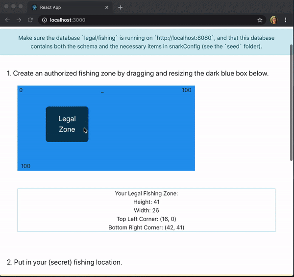
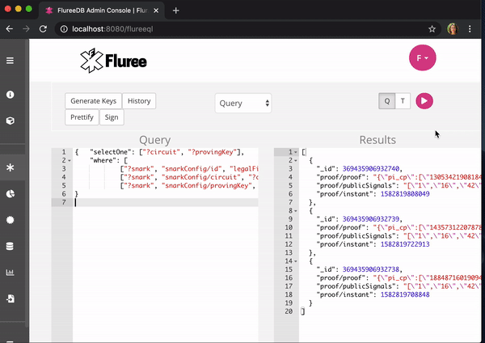
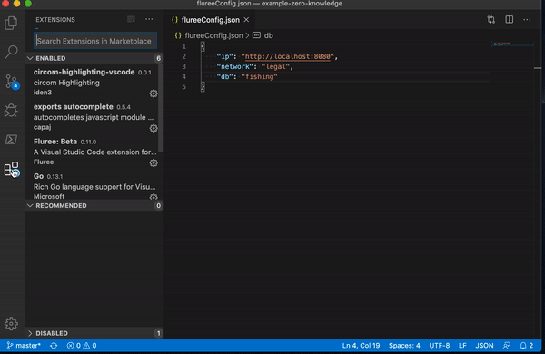

## Legal Fishing

This Github repo demonstrates how one could set up a Fluree ledger to use zero-knowledge proofs.

In this example, Fluree is deployed as a backend data management platform in managing trusted data. The use-case is a simple example of:

1. the establishment of a dynamic zone where fishing is allowed
2. the ability for boats to input catch locations without disclosing where the catch was precisely made
3. the ability for a third party to validate that the fish was caught in an allowed zone, without disclosing their catch location

Please check out the accompanying [blog post](https://flur.ee/2020/02/05/using-zero-knowledge-proofs-with-fluree/) and [video](https://youtu.be/LlBBaorIzgs) !

Features demonstrated: zero knowledge proofs, data immutability, and traceability. 



### Get Started

1. `Start Fluree`

Download and unzip this [Fluree packet](https://fluree-examples.s3.amazonaws.com/fluree-zero-knowledge-packet.zip). The packet contains Fluree, version 0.13.0, as well as a prepopulated database with the schema, seed data, and several example proofs (`resources/schema.json` and `resources/seed.json` have the schema and seed transaction, respectively).

Navigate to the folder where you downloaded the packet, and run `./fluree_start.sh`. If you have Java 8+ installed, this should launch Fluree, and a Admin Console will be available for you to explore at `http://localhost:8080`. `resources/example_queries.js` has example queries you can test out directly in the Admin Console.

2. `Start the App`

```
git clone https://github.com/fluree/legal-fishing.git
```

```
cd legal-fishing
```

```
npm install
```

```
npm start
```

### How Does it Work

Zero-knowledge proofs allow you to prove that your secret information fits certain parameters without sharing your secret information. We used Iden3's [circom](https://github.com/iden3/circomlib) to create the circuit used in this app, and Iden3's [snarkjs] to handle proof generation and verification. 

Please check out the accompanying [blog post](https://flur.ee/2020/02/05/using-zero-knowledge-proofs-with-fluree/) for more information about the zero knowledge proofs used in this example.

#### Query to Get Circuit

This app uses a single circuit, which we use to generate all the proofs. We store the circuit, proving key, and verification key in the `snarkConfig` collection under the `id` `legalFishing`. We use the below query to fetch the circuit and proving key. 

```
{   "selectOne": ["?circuit", "?provingKey"],
    "where": [
            ["?snark", "snarkConfig/id", "legalFishing"],
            ["?snark", "snarkConfig/circuit", "?circuit"],
            ["?snark", "snarkConfig/provingKey", "?provingKey"]]
}
```

#### Transaction to Submit Proof

The below transaction is used to create a new proof, and link that proof to the `snarkConfig`, which is storing the relevant circuit and keys. 

```
[{
    "_id": ["snarkConfig/id", "legalFishing"],
    "proofs": ["proof$1"]
  }, 
  {
    "_id": "proof$1",
    "proof": "PROOF HERE",
    "instant": "#(now)",
    "publicSignals": "PUBLIC SIGNALS HERE"
  }]
```

#### Query to Get All Proofs Connected to the legalFishing Circuit

The below query gets all the proofs that are connected to the legalFishing circuit.

```
{
    "select": ["?proof", "?proofBody", "?publicSignals", "?verificationKey", "?instant"],
    "where": [
                    ["?proof", "proof/proof", "?proofBody"],
                    ["?proof", "proof/publicSignals", "?publicSignals"],
                    ["?proof", "proof/instant", "?instant"],
                    ["?config", "snarkConfig/id", "legalFishing"],
                    ["?config", "snarkConfig/verificationKey", "?verificationKey"]
    ]
}
```

There are other example queries that you can try out in `/resources/example_queries.js`.



#### Visual Studio Code
If you are using Visual Studio Code to view this repo, you can issue the example queries using the extension.

1. Download the `Fluree: Beta extension`. In the top menu bar, select `View` > `Extensions`. Then search `Fluree: Beta` and click install.
2. Open the Command Palette by going to `View` > `Command Palette`, and issue `Fluree: Set Config`.
3. Highlight any query in `resources/example_queries.js`, using the Command Palette, issue, `Fluree: Query`, and the results of the query will appear in a `flureeResponse.txt` file. Note: every time you issue a query or transaction, this file gets overwritten.



### Resources

To see more example projects, visit our [example repo](https://github.com/fluree/examples). 

This example also has an accompanying [blog post](https://flur.ee/2020/02/05/using-zero-knowledge-proofs-with-fluree/) and [video](https://youtu.be/LlBBaorIzgs).


Check out our entire [documentation](https://docs.flur.ee/) or jump directly to the section on [full-text search](https://docs.flur.ee/docs/database-setup/database-settings#language).

You can also engage with us via email, `support@flur.ee`.

Or by [Slack](https://launchpass.com/flureedb).


